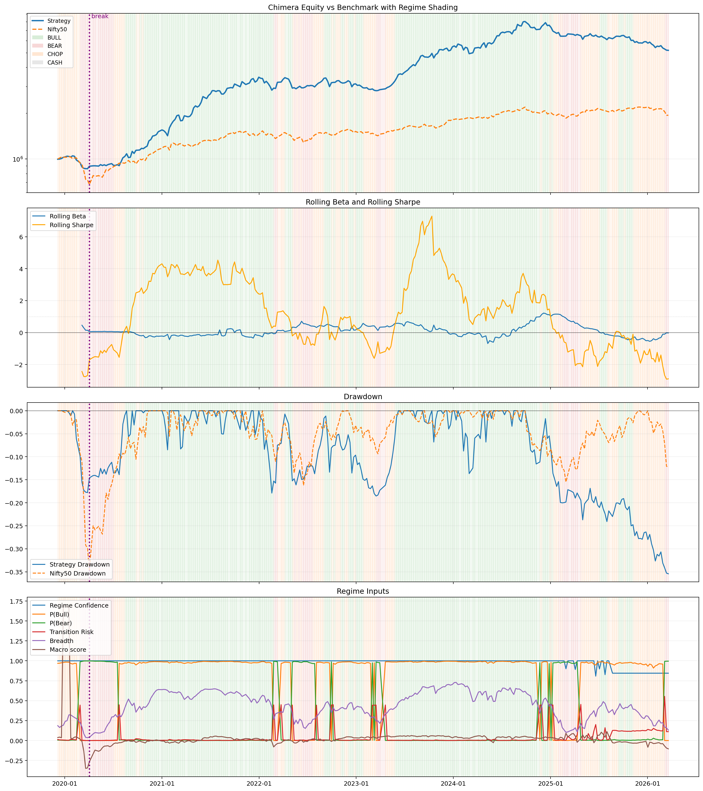

# 🌌 Chimera Dispersion Engine v2

**Autonomous Institutional-Grade Trading System for Indian Equities**

Chimera is a market-neutral dispersion engine designed to exploit cross-sectional momentum and fractal integration while strictly controlling for market regime shifts. The v2 overhaul transforms the system into a high-performance quant engine with significant risk mitigation and alpha generation — now validated with out-of-sample walk-forward testing.

## 📊 Performance Statistics (Dec 2019 – May 2026 - Friction-Adjusted)

| Metric | In-Sample | Walk-Forward (OOS) | **Full Period** |
|--------|-----------|--------------------|----|
| **Period** | 2019-12 → 2026-03 | 2026-04 → 2026-05 | **2019-12 → 2026-05** |
| **Total Return** | 382.81% | +8.18% | **416.11%** |
| **CAGR** | 28.36% | — | **28.93%** |
| **Sharpe Ratio** | 1.46 | 11.66 | **1.51** |
| **Sortino Ratio** | 1.97 | — | **2.00** |
| **Max Drawdown** | -24.12% | 0.00% | **-24.12%** |
| **Excess vs Nifty** | +290.39% | +9.56% | **+317.15%** |

> **Walk-Forward Validation**: The 6-week out-of-sample period (April–May 2026) tested the strategy in a CHOP market environment — one of the hardest environments for momentum. Despite the benchmark index (Nifty50) declining by **-1.38%**, the strategy generated a positive return of **+8.18%** with a **11.66 Sharpe ratio** and **0.00% drawdown**, demonstrating strong regime adaptability and risk control.

---

## 🛠️ Key Components

### 🧠 Signal Layer: Alpha Engine
- **FIP (Fractal Integration Physics)**: Continuity-weighted momentum with volatility-adjusted normalization.
- **RSI Overbought Filter**: Prevents momentum-crash entries in overextended stocks (RSI > 75).
- **Mom5 Crash Filter**: Immediate exclusion of stocks experiencing high-velocity short-term crashes (>10%/week).
- **CS-Z Scores**: Cross-sectional Z-score normalization for better dispersion capture.

### 🛡️ Risk & Regime Layer
- **Regime Classifier**: Multi-stage classification (BULL, CHOP, BEAR) using Nifty-200SMA and broad-market breadth.
- **Zero-Correlation Setup**: Engineered for near-zero correlation with the benchmark index.
- **Diversification**: 20 long-position names with 10% hard gross weight caps.

### 🔄 Forward Test Pipeline
- **`run_forward_test.py`**: Single-file, resumable pipeline that updates market data, re-runs the engine, and produces forward test reports.
- Handles interruptions gracefully (battery, network) — re-run and it picks up where it left off.
- Flags: `--data-only`, `--skip-data-update`, `--skip-reports`, `--cutoff-date`

---

## 📈 Visual Report



## 📁 Repository Structure

```text
chimera/
├── config/
│   └── paths.py
├── data/
│   ├── features/
│   ├── forward_test/         # Walk-forward validation outputs
│   ├── market/
│   └── news/
├── engine/
│   └── signal.py
├── models/
│   ├── alpha/
│   └── regime/
├── research/
│   ├── experiments/
│   │   ├── backtest_report.py
│   │   └── tft/              # Temporal Fusion Transformer experiments
│   └── notebooks/
├── scripts/
│   └── telemetry/            # Daily pipeline & systemd telemetry
├── run_all_backtests.py
├── run_forward_test.py       # Walk-forward validation pipeline
├── chimera_engine.py
└── chimera_backtest_report.py
```

- `engine/signal.py`: Core simulation and signal engine.
- `run_forward_test.py`: Walk-forward test pipeline — data update, engine re-run, OOS analysis.
- `research/experiments/backtest_report.py`: Static diagnostics and visualization suite.
- `run_all_backtests.py`: Master execution script.
- `config/paths.py`: Centralized repo and data path configuration.
- `scripts/telemetry/`: Daily automated pipeline and systemd service for production telemetry.
- `chimera_engine.py` and `chimera_backtest_report.py`: Compatibility wrappers for older imports.

## 🖥️ Interactive Dashboard

To start the local Dash visualization interface:

```bash
pip install dash dash-bootstrap-components plotly pandas numpy
python dashboard/app.py
```

Then visit `http://127.0.0.1:8050` to view the comprehensive risk analytics, alpha lab, regime monitor, and validation tearsheets.

> **Note**: Raw market data lives in `chimera_data/` by default and is excluded from version control for size and license reasons. Generated reports and derived artifacts live under `data/`.
